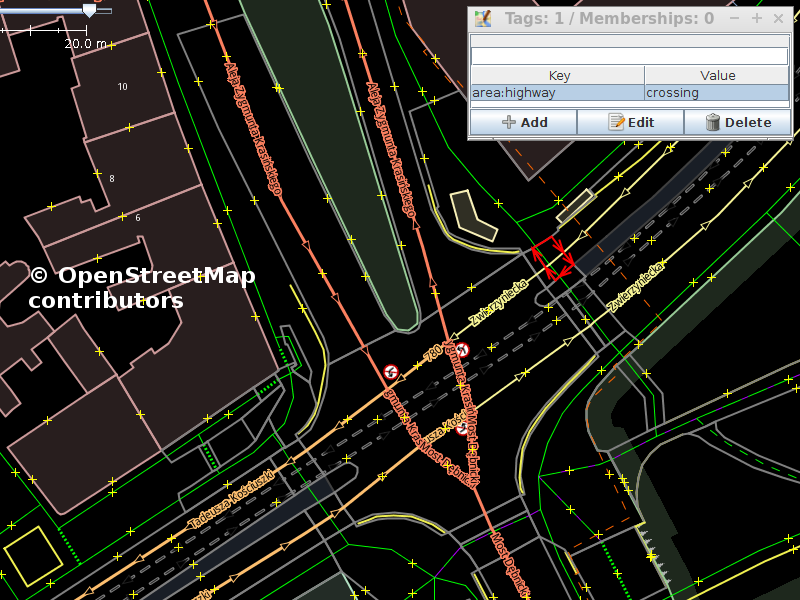

Tool for making tactile maps out of OpenStreetMap data.

# Map of crossing for blind or visually impaired

3D map of single crossing may be an useful aid during teaching blind people how to move through city.

In this case map is made in a laser cutter from by cutting and engraving plywood and later gluing pieces together to make a map.

This repository contains code for generating SVG files that can be used to make such map.

# Generation
## Mapping
It is likely that shape of road and footway surfaces is not yet mapped for crossing that is interesting for you.

But existing editors (especially [Vespucci](https://github.com/MarcusWolschon/osmeditor4android) and [JOSM](http://josm.openstreetmap.de/)) will make data collection much easier that it would be with starting new project from scratch.

There will be collected set of aerial imagery (on open license), roads itself and nearby buildings may be mapped already. All of that should make things easier than starting from scratch.

## Processing data.

Code in this repository downloads and processes from OpenStreetMap areas tagged with `building=*` and `area:highway=*` tags.

It gives SVG files as an output.

## Laser

Laser cuts and engraves plywood pieces as instructed by generated SVG files.

## Assembly

Now it is time for painting cut pieces (in colours suitable for visually impaired, according to my consultation black for roads and yellow for footways, with zebra pattern for crossings is likely to be a good fit).

After that map is ready for final assembly by gluing cut pieces.

# Disclaimer

Currently this software is a work in progress. Not even a single map was made so far, but first prototype should be ready in a near future :)

See https://github.com/matkoniecz/map-carver/issues for things that are documented as missing.

# Mentions of use are welcome

In case that you used this code or it inspired you to do something - feel free to create an issue with photo and/or description of what was produced! It would be nice to have confirmation that publishing it was useful for somebody.

# Improving documentation

Please create a new issue if you want to use it but current instructions are insufficient, wrong or can be in some way improved!

I know that documentation may be far better, but I am not sure what kind of additional documentation would be most useful.

# Sponsors

 

The [OpenStreetMap foundation](https://wiki.osmfoundation.org/wiki/Main_Page) was funding the development of this project in their first round of the [microgrant program](https://wiki.osmfoundation.org/wiki/Microgrants) in 2020. It was done as part of making [tactile maps based on OpenStreetMap data, for blind or visually impaired children](https://wiki.openstreetmap.org/wiki/Microgrants/Microgrants_2020/Proposal/Tactile_maps_for_blind_or_visually_impaired_children).

If anyone else is also interested in supporting this project via funding - [let me know](mailto:osm-messages@etutanota.com) (opening a new issue is also OK) :)
